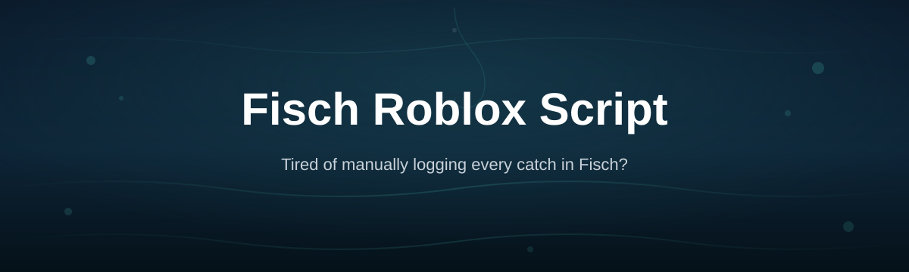
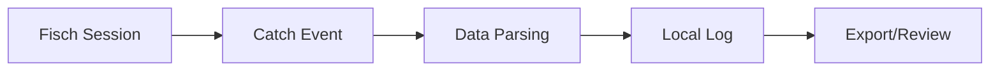

# fisch-catch-tracker

| Requirement | Details |
|---|---|
| OS | Windows 10 or 11 |
| Setup | Standalone, no install wizard |
| Game | Fisch on Roblox |
| Toolchain | None needed |

*A catch-logging companion for Fisch players who want to know exactly what they've reeled in, without digging through screenshots.*

## What this is

**fisch-catch-tracker** is a lightweight companion tool built around Fisch, the Roblox fishing game. Instead of manually screenshotting every rare catch or trying to remember which rod pulled in that mutated fish an hour ago, this tool watches your session and keeps a running, readable log of what you caught, when, and under what conditions.

It's built for players who treat Fisch progression seriously — grinding for exotic variants, tracking rod performance across zones, or just wanting a personal catch history they can look back on. The tool itself doesn't play the game for you; it observes and organizes, so your inventory decisions are based on data instead of guesswork.

  

The button above opens the project's landing page, where the latest build is available to download.

## Who it is for

- Players grinding rare or mutated fish spawns and wanting proof of RNG patterns
- Anyone comparing rod and bait combinations across different Fisch zones
- Roblox streamers who want a clean on-screen catch log instead of chat spam
- Players tracking personal bests or completing catch-log style checklists
- Fisch community members compiling data for guides or trade valuations

## What you can do

- **Log every catch automatically** with fish name, weight, and rarity tier
- **Track rod and bait combos** to see which setups actually produce results
- **Filter catch history by zone**, time of day, or weather condition
- **Export session summaries** as a plain text or CSV file for later review
- **Flag rare and mutated catches** separately from your regular catch feed
- **Monitor session streaks** — casts, catches, and time-per-catch averages
- **Run alongside Fisch** without touching game files or settings
- **Reset or archive logs** per session so history stays organized

## Getting started

1. Open the landing page using the download button above.
2. Download the latest release build for Windows.
3. Extract the files to any folder — no installer runs.
4. Launch the executable, then open Fisch in Roblox as usual.
5. Start fishing; catches populate the log window automatically.

## Requirements

- Windows 10 or 11 (64-bit)
- Roblox with Fisch installed and running normally
- No Python, Node, or build tools required
- No account credentials or Roblox login needed by the tool itself

## How it works

1. The tool starts alongside your normal Fisch session.
2. It watches for in-game catch events as they happen.
3. Each catch is parsed into fish name, weight, and rarity.
4. Entries are appended to a local, timestamped log.
5. You review, filter, or export the log whenever you want.

<strong>FAQ — common questions about Fisch Roblox Script tools</strong>

**Does this modify or automate Fisch gameplay?**
No. It only reads catch events to build a log; it doesn't cast rods or make decisions for you.

**Will this get my Roblox account flagged?**
It doesn't inject into Roblox or alter game memory — it observes visible catch data, similar to reading your own chat log.

**Can I use this on Mac or mobile?**
Not currently. The standalone build targets Windows 10/11 only.

**Does it track every fish, including event or limited-time variants?**
Yes, as long as the catch triggers a standard in-game catch event, it gets logged.

**Can I export my catch history to share with friends?**
Yes, sessions can be exported as plain text or CSV for sharing or spreadsheet use.

<strong>Troubleshooting</strong>

**The tool opens but no catches appear in the log**
Confirm Fisch is running in the same Roblox window session and that you've cast at least once after launching the tracker.

**Log window shows garbled or missing fish names**
Update to the latest release from the landing page — older builds may not recognize newer Fisch fish entries.

**Export file is empty**
Make sure you've had at least one logged catch in the current session before exporting.

**Windows flags the executable on first run**
This is common for small standalone tools without a paid code-signing certificate; verify the download came from the official landing page before proceeding.

## License

Released under the [MIT License](LICENSE). This project is an independent, community-made companion tool and is not affiliated with or endorsed by the developers of Fisch or Roblox Corporation. Use it at your own discretion.

  

